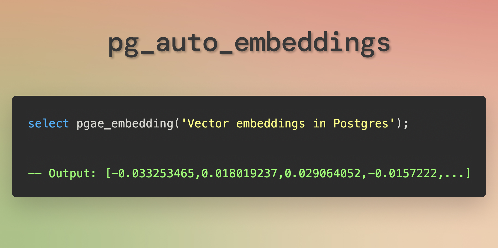

<div align="center">

# 🤖 pg_auto_embeddings

[](https://www.postgresql.org/downloads/)
[](https://opensource.org/licenses/MIT)
[](https://x.com/elkornacio)
[](https://github.com/elkornacio/pg_auto_embeddings/issues)
[](https://github.com/elkornacio/pg_auto_embeddings/stargazers)

`select embedding('text')` for Postgres. Without extensions. Simple, atomic, transaction-safe. Supports OpenAI embeddings out-of-the-box. Installation via SQL file. Perfect fit for RAG systems.



</div>

<div align="center">

## 📋 Table of Contents

[Overview](#overview) •
[Quick Start](#quick-start) •
[On-premise](#on-premise) •
[Key Features](#key-features) •
[Contribution](#contribution-and-development) •
[FAQ](#faq)

</div>

**pg_auto_embeddings** is an open-source project designed to provide a simple, atomic, transaction-safe function for calculating text embeddings in PostgreSQL. Its main feature is that it does not require any additional extensions, making it suitable for managed databases and other restricted environments. It uses Foreign Data Wrappers (FDW) as way to call embedding APIs though a public or on-premise proxy server.

## Quick Start

1. Run `simple/pgae_simple_install.sql` ([here it is](simple/pgae_simple_install.sql)) on your database.
2. Call `pgae_init('openai-text-embedding-...', '<api-key>')` to initialize. Provide the model and API key.

### Usage

- Use `SELECT pgae_embedding('some text')` to get vector embedding as `double precision[]`.
- Use `SELECT pgae_embedding_vec('some text')` to get vector embedding as `vector`.

## Supported Models

#### OpenAI:

- `openai-text-embedding-3-small`
- `openai-text-embedding-3-large`
- `openai-text-embedding-ada-002`

## On-premise

1. Run `docker run -d -p 5432:5432 elkornacio/pg_auto_embeddings` to start your own proxy server. You can apply whitelists, rate limits, etc via environment variables (read below).
2. Call `pgae_init_onprem('your.host.com', '5432', 'openai-text-embedding-3-small', 'sk-...')` to initialize. Provide the model you use for embeddings and your API key.
3. Use `SELECT pgae_embedding('some text')` to get vector embedding.

## Key Features

- **No Extensions Required**: Works seamlessly without needing to install PostgreSQL extensions.
- **Two Installation Options**:
  1. **Simple Installation**: Just execute a SQL script for quick setup.
  2. **On-Premise Installation**: Use an on-premise Docker server as a proxy for embedding API calls.
- **Supports Public and Local APIs**: Can be configured to work with both public APIs and local solutions.

### Usage

- Initialize for a remote server with open APIs:

  ```sql
  CALL pgae_init('openai-text-embedding-model', 'MY_OPENAI_API_KEY');

  ```

- Calculate embedding for a single text:

  ```sql
  SELECT pgae_embedding('some text'); -- returns double precision[]
  ```

- Calculate embedding for a single text with `pgvector` extension:

  ```sql
  SELECT pgae_embedding_vec('some text'); -- returns vector
  ```

- Create an auto-embedding calculation for the column `title` in the table `posts` (`public` schema):

  ```sql
  SELECT pgae_create_auto_embedding('public', 'posts', 'title', 'title_embedding');
  ```

  Now, on INSERT or UPDATE of `title`, embedding in the `title_embedding` column will be updated automatically.

- Completely remove `pg_auto_embeddings` from your database:
  ```sql
  SELECT pgae_self_destroy();
  ```

### On-Premise Enviroment Variables

- `PG_HOST` - Host of your database, default `localhost`. That's the host which Node.js server is connected on start. Don't change it unless you know what you're doing.
- `PG_PORT` - Port of your database, default `5432`. That's the port which Node.js server is connected on start. Don't change it unless you know what you're doing.
- `PG_USERNAME` - Username of your database. You must provide you own value to ensure security.
- `PG_PASSWORD` - Password of your database. You must provide you own value to ensure security.
- `SERVER_HOST` - Host Node.js proxy server is listening on, default `localhost`.
- `SERVER_PORT` - Port Node.js proxy server is listening on, default `3000`.
- `SELF_URL` - URL of the Node.js server, default `http://localhost:3000`. All internal requests from Postgres proxy to Node.js are made on this URL.
- `CONTROL_SERVER_HOST` - Host Control Server is listening on. When this variable is not provided, Control server does not start.
- `CONTROL_SERVER_PORT` - Port Control server is listening on. When this variable is not provided, Control server does not start.

## Contribution and Development

- Issues and Pull Requests are welcome for feedback, improvements, and new ideas.
- The project is open to suggestions for expanding functionality and enhancing stability.

## FAQ

- How to install `pg_auto_embeddings` on a new database?

  Execute SQL code from `simple/pgae_simple_install.sql` ([here it is](simple/pgae_simple_install.sql)) on your database.
  Then call `pgae_init('<model>', '<api_key>')` to initialize. Provide the model you use for embeddings and your API key.

- Do you support OpenAI embeddings?

  Yes, it's the only supported model right now.

- How to remove `pg_auto_embeddings` from my database?

  ```sql
  SELECT pgae_self_destroy();
  ```

- How does it work?

  We use Foreign Data Wrappers (FDW) to call functions on the remote PostgreSQL server. The chain is:

  1. We create FDW table local `embeddings_*` -> remote `embeddings_*`
  2. You call local function `pgae_embedding('some text')`
  3. It executes `UPDATE embeddings SET ...` on a local table
  4. FDW causes synchronous execution of `UPDATE embeddings SET ...` on the remote table
  5. It causes synchronous execution of the trigger like `NEW.embedding = pgae_embedding_internal(NEW.text_val); RETURN NEW.embedding;`
  6. It executes `pgae_embedding_internal` function which calls HTTP API of local Node.js server
  7. Node.js server calls OpenAI API and returns embedding as a result
  8. Remote PostgreSQL propagates the result to the remote `embeddings_*` table
  9. Local PostgreSQL receives update on local `embeddings_*` table
  10. This update is propagated as result of the execution of `pgae_embedding('some text')`

  The code of both server SQL and local SQL in this repo. So, you can look for additional details in the code and ask any questions in Issues.

## License

This project is licensed under the [MIT License](LICENSE). You are free to use the code in your projects while retaining the original author notifications.

Enjoy using **pg_auto_embeddings**! We hope it simplifies the integration of text embeddings in PostgreSQL without the need for complex extensions.
